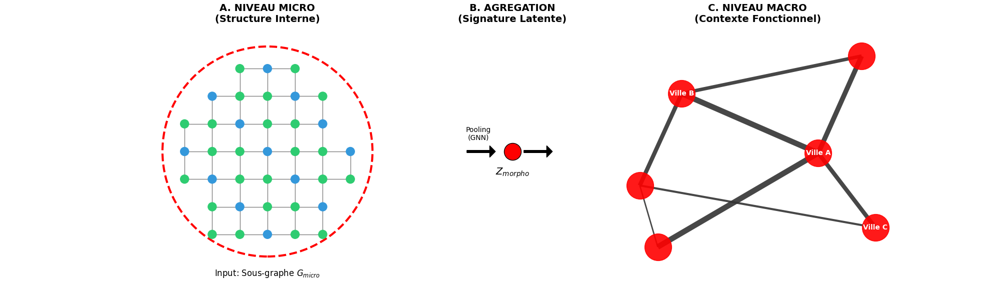

# 🏙️ GNN Villes : Segmentation Morpho-Dynamique des Territoires

> **Une approche "fractale" et auto-supervisée pour la typologie des villes françaises par GNN Hiérarchique.**

**Architecture Hiérarchique Micro/Macro**


## 🎯 Objectif Scientifique

Ce projet propose une nouvelle méthodologie pour classer les territoires, dépassant les typologies classiques "urbain/rural" qui gomment souvent la structure interne des lieux via des agrégations administratives.

Notre approche repose sur une **hypothèse de "Désintrication" (Disentanglement)** :

1.  **L'Invariant (Forme)** : La structure physique (bâti, topographie) est stable.
2.  **Le Variant (Fonction)** : La dynamique socio-économique (revenus, flux) est volatile.

Le modèle cherche à apprendre une représentation où l'identité d'une ville émerge de la tension entre sa **forme interne** (Micro) et ses **connexions externes** (Macro).

## 🧠 Architecture du Modèle (GNN Hiérarchique)

[cite_start]Le modèle traite le territoire comme un système de systèmes à deux échelles [cite: 2054-2055] :

### Niveau 1 : Micro (Intra-Communal) 🧩

  * **Unité :** Carreau de grille 1km (INSEE/Eurostat).
  * **Données :** Topographie (IGN), Occupation du Sol (OSO), Bâti.
  * **Mécanisme :** La ville est vue comme un **nuage de points** (sous-graphe de carreaux). [cite_start]Un **GCN (Graph Convolutional Network)** lisse l'information locale pour extraire une "signature morphologique" unique ($Z_{morpho}$) invariante à la position absolue [cite: 2067-2082].

### Niveau 2 : Macro (Inter-Communal) 🌐

  * **Unité :** Commune.
  * **Données :** Flux de navettes (Domicile-Travail), Migrations résidentielles, Squelette routier.
  * **Mécanisme :** Les signatures locales sont injectées dans un graphe national. [cite_start]Un **GAT (Graph Attention Network)** pondère l'influence des voisins selon l'intensité des flux et la perméabilité des frontières [cite: 2083-2095].

### Stratégie d'Apprentissage : "Inpainting" Géographique 🎨

Le modèle est entraîné de manière **auto-supervisée** (sans labels "urbain" préexistants).

  * **Tâche :** On masque aléatoirement les variables sociales (revenus, densité) d'une ville.
  * **Objectif :** Le modèle doit reconstruire ces valeurs manquantes en utilisant uniquement (1) la forme physique du bâti et (2) le voisinage fonctionnel.
  * **Intuition :** Pour réussir, le réseau doit comprendre la corrélation profonde *Forme + Flux = Fonction*.

-----

## 🛠️ Installation

Le projet utilise `uv` pour la gestion rapide des dépendances Python et nécessite un environnement Linux (pour `torch_geometric` et `gdal`).

### Pré-requis

  * Python \>= 3.12
  * Bibliothèques système : `7zip` (pour l'extraction des données IGN)

### Configuration Rapide

Utilisez le script d'installation fourni :

```bash
chmod +x launch.sh
./launch.sh
```

Ou manuellement :

```bash
# 1. Installation de uv
pip install uv

# 2. Création de l'environnement
uv venv .venv
source .venv/bin/activate

# 3. Installation des dépendances (incluant PyTorch Geometric)
uv sync
# Note: torch-scatter/sparse sont installés via wheel pour compatibilité CUDA
uv pip install torch-cluster torch-scatter torch-sparse -f https://data.pyg.org/whl/torch-2.5.0+cu124.html
```

-----

## 🚀 Utilisation

### 1\. Préparation des Données (ETL)

Le pipeline de pré-traitement télécharge les données brutes (IGN, INSEE), construit les graphes (adjacence des carreaux, réseau routier) et génère les fichiers `.parquet` et `.pt`.

```bash
# Lance le pipeline complet (peut être long)
uv run prepare-gnn-data
# Ou via le script python direct
python -m src.preprocessing.main
```

*Les données générées seront stockées dans `data_GNN/`.*

### 2\. Entraînement du Modèle

Lancez la boucle d'apprentissage auto-supervisé :

```bash
python -m src.processing.train
```

Le script va :

1.  Charger le Dataset Hiérarchique (Micro + Macro).
2.  Appliquer le **Zero-Masking** sur les variables sociales.
3.  Entraîner le GNN à reconstruire les profils communaux.
4.  Sauvegarder les checkpoints dans le dossier courant.

-----

## 📂 Structure du Projet

```
GNN_villes/
├── data_GNN/                # Données traitées prêtes pour le modèle
│   ├── statistiques_carreaux.parquet.gz  # Nœuds Micro (Features)
│   ├── edges_toutes_communes.npy         # Arêtes Micro (Intra)
│   ├── graph_macro_physique.pt           # Squelette Macro (PyTorch)
│   └── ...
├── src/
│   ├── preprocessing/       # Scripts ETL (Extraction & Graphes)
│   │   ├── bdtopo.py        # Traitement réseau routier IGN
│   │   ├── graph_utils.py   # Construction des adjacences (Queen/Flux)
│   │   └── tile_processing.py # Rasterisation & Stats carreaux
│   └── processing/          # Cœur du Deep Learning
│       ├── datasets.py      # Dataset PyG (Fusion Micro/Macro)
│       ├── model.py         # Architecture GNN (GCN + GAT + Décodeur)
│       └── train.py         # Boucle d'entraînement & Masquage
├── launch.sh                # Script d'installation
├── pyproject.toml           # Configuration du projet & Dépendances
└── README.md
```

## 📜 Licence

Ce projet est sous licence **MIT**. Voir le fichier LICENSE pour plus de détails.

